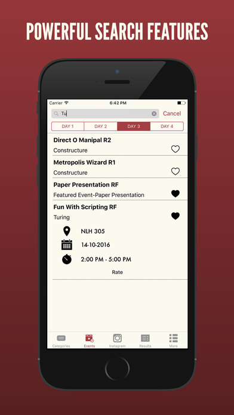

# TechTatva '16

The Official App for the annual techfest TechTatva of Manipal Institute of Technology

Open-Source Project.

--------------------
##Features

- Offline Save
- Get Results on the go
- Powerful Search Features
- Instagram Integration (Use #techtatva16 when posting pictures on Instagram)
- Beautiful UI
- Direct access to Online Events

--------------------
### Keys

The Project uses [Firebase](https://firebase.google.com) as backend and therefore needs Client key and Application ID.  
To obtain these you may message us at our [Facebook Page](https://www.facebook.com/LUGManipal/).
